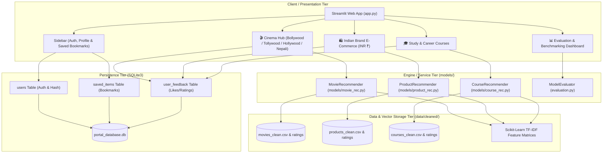
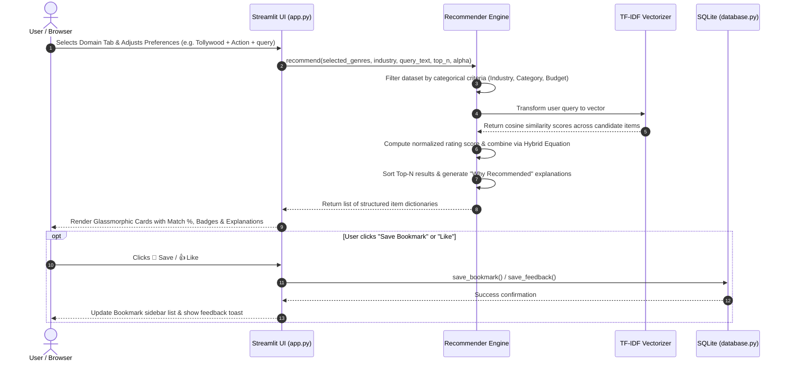
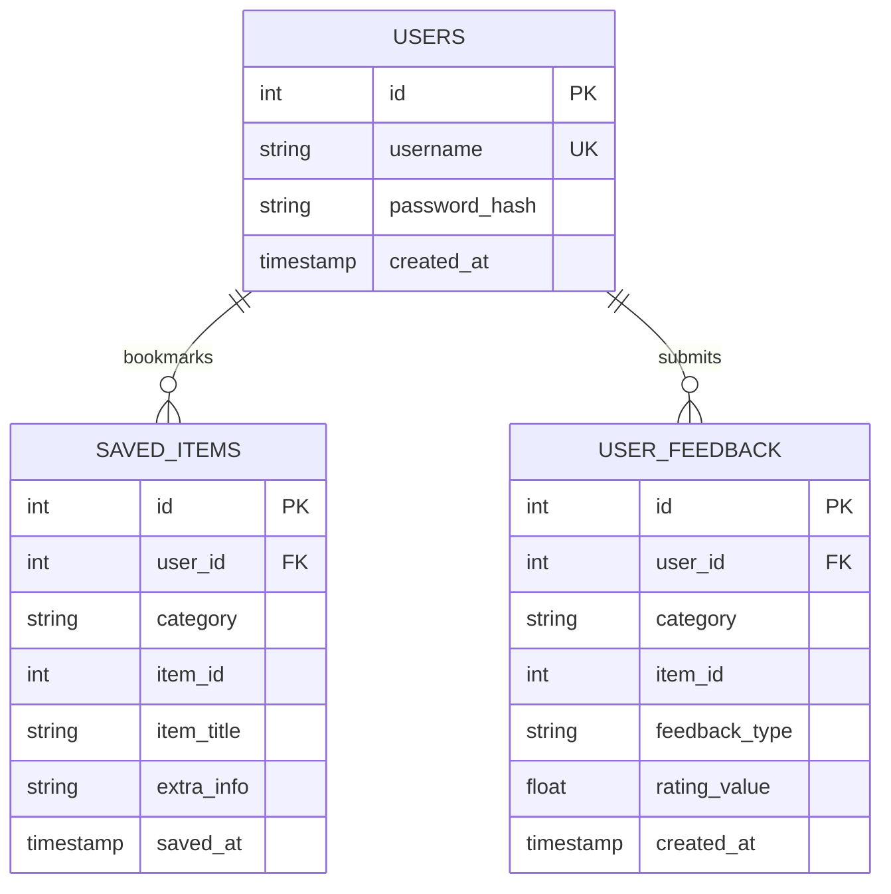

# ARCHITECTURE.md — Codebase & System Architecture Overview 🏛️

## 1. System Architecture Overview

**RECOM.ai** is engineered as a decoupled, multi-tier recommendation platform. The system separates the **Presentation Layer (Streamlit)** from the **Domain Recommender Engines**, **Feature Stores (TF-IDF Matrices)**, and **Persistence Store (SQLite3)**.



---

## 2. Codebase Inventory & Component Responsibilities

| File Path | Component Name | Primary Role & Responsibilities |
| :--- | :--- | :--- |
| [`app.py`](file:///d:/Recommendation-System/app.py) | **Main Web Portal** | Streamlit UI orchestration, custom dark glassmorphic CSS styling, reactive state management, card rendering, and user action routing. |
| [`models/movie_rec.py`](file:///d:/Recommendation-System/models/movie_rec.py) | **Movie Engine** | Hybrid recommendation engine with explicit cinema industry segmentation (**Bollywood, Tollywood, Hollywood, Nepali Cinema**), genre filtering, and TF-IDF plot search. |
| [`models/product_rec.py`](file:///d:/Recommendation-System/models/product_rec.py) | **Product Engine** | E-commerce recommendation engine focused on **Indian brands** (*boAt, Noise, Boult, Fastrack, etc.*) with pricing in **INR (₹)** and category/budget sliders. |
| [`models/course_rec.py`](file:///d:/Recommendation-System/models/course_rec.py) | **Course Engine** | Skill-interest matching for career certifications (*Google, Stanford, Meta, Harvard, IBM*) with difficulty filtering and syllabus vector search. |
| [`models/__init__.py`](file:///d:/Recommendation-System/models/__init__.py) | **Models Package Init** | Clean unified export interface for all three recommendation engines. |
| [`database.py`](file:///d:/Recommendation-System/database.py) | **Database Manager** | SQLite3 interface for user account registration, login verification (SHA-256), bookmarked items, and interaction feedback tracking. |
| [`evaluation.py`](file:///d:/Recommendation-System/evaluation.py) | **Evaluation Suite** | 80/20 train/test holdout validation measuring `Precision@5`, `Recall@5`, and `RMSE` against baseline algorithms. |
| [`DESIGN.md`](file:///d:/Recommendation-System/DESIGN.md) | **Design Specification** | UI visual tokens, dark glassmorphic theme specifications, color palettes, and mathematical scoring formulations. |
| [`README.md`](file:///d:/Recommendation-System/README.md) | **Documentation** | Public project documentation, feature highlights, quick-start guide, and evaluation results. |

---

## 3. Detailed Data Flow & Execution Sequence



---

## 4. Recommender Engine Algorithmic Contract

Each recommender engine adheres to a standardized architectural pattern:

### 1. Unified Return Schema
All engine methods return a list of dictionaries containing:
```python
{
    "id": int,              # Unique entity ID
    "title" / "name": str,  # Entity title
    "category" / "genres": list or str, # Categorical tags
    "rating": float,        # Normalised community rating (1.0 to 5.0)
    "match_score": float,   # Calculated hybrid match percentage (0.0% to 100.0%)
    "explanation": str,     # Human-readable "Why Recommended" explanation
    # Domain specific extras (e.g. price_inr, brand, url, duration_hours)
}
```

### 2. Hybrid Mathematical Scoring Model
For item $i$ and search context $q$:

$$\text{ContentScore}(i, q) = \frac{\vec{V}_q \cdot \vec{V}_i}{\|\vec{V}_q\| \|\vec{V}_i\|}$$

$$\text{RatingScore}(i) = \frac{\text{Rating}(i)}{\text{MaxRating}}$$

$$\text{HybridScore}(i) = \alpha \cdot \text{ContentScore}(i, q) + (1 - \alpha) \cdot \text{RatingScore}(i)$$

$$\text{MatchScore\%}(i) = \text{Round}(\text{HybridScore}(i) \times 100, 1)$$

* The parameter $\alpha \in [0.0, 1.0]$ allows the user to balance **Personalized Content Overlap** ($\alpha \to 1.0$) against **Crowd Wisdom & Popularity** ($\alpha \to 0.0$).

---

## 5. Database Entity Relationship (ER) Diagram



---

## 6. Evaluation Methodology & Holdout Benchmarking

The evaluation suite ([`evaluation.py`](file:///d:/Recommendation-System/evaluation.py)) implements an 80/20 per-user holdout validation strategy:

1. **Precision@K:** Ratio of recommended items in the top-K that the user rated $\ge 4.0$:
   $$\text{Precision@K} = \frac{|\text{Top-K Recommended} \cap \text{User Relevant Items}|}{K}$$
2. **Recall@K:** Ratio of the user's high-rated items captured in the top-K recommendations:
   $$\text{Recall@K} = \frac{|\text{Top-K Recommended} \cap \text{User Relevant Items}|}{|\text{User Relevant Items}|}$$
3. **RMSE (Root Mean Square Error):** Measures rating prediction error against holdout ratings:
   $$\text{RMSE} = \sqrt{\frac{1}{N} \sum_{u,i} (R_{u,i} - \hat{R}_{u,i})^2}$$

---

## 7. Extensibility & Future Roadmap

* **Bonus Domain (Diet Module):** Adding meal recommendations by calorie budget, macros, and vegetarian/vegan filters with visible health disclaimers.
* **Vector Embeddings (Neural Search):** Migrating from TF-IDF sparse vectors to dense neural embeddings (`sentence-transformers/all-MiniLM-L6-v2`) with FAISS indexing for semantic retrieval.
* **Cross-Domain User Profiles:** Utilizing unified user vectors to cross-recommend (e.g., recommend data science desk setups to users studying machine learning).
