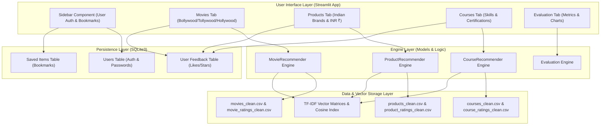

# DESIGN.md — RECOM.ai (Multi-Domain Recommendation Portal) 🔮

## 1. Executive Vision & Concept

**RECOM.ai** is a state-of-the-art, non-generic Multi-Domain Recommendation Portal. Unlike traditional basic recommendation demos, RECOM.ai delivers a unified, highly polished user interface with real-time explainable recommendations across three rich domains:

1. 🎬 **Movies (Cinema Hub):** Seamless switching between **Bollywood (Hindi)**, **Tollywood (Telugu)**, **Hollywood (English)**, and **Nepali Cinema** with plot keyword search and genre vector matching.
2. 🛍️ **Indian Brand E-Commerce & Lifestyle:** Next-gen product recommendations featuring top **Indian lifestyle, horology & electronics brands** (*Titan, HMT, Fastrack, Sonata, Titan Skinn, Bella Vita Luxury, Bombay Shaving Company, The Man Company, Villain, Forest Essentials, Phool, boAt, Noise, Boult*) across audio, watches, fragrance, and gear priced in **INR (₹)**.
3. 🎓 **Study & Career Courses:** Skill-interest matching for top professional certificates (*Google, Stanford, Meta, IBM, Harvard*) across AI, Data Science, Software Engineering, Cloud, and Cybersecurity.
4. 📊 **Evaluation & Analytics Dashboard:** Real-time holdout benchmarking metrics (*Precision@K, Recall@K, RMSE*) comparing Popularity Baseline vs. Content-Based vs. Collaborative vs. Hybrid models.

---

## 2. Design Aesthetics & Visual Tokens 🎨

### Color System (Modern Dark Glassmorphism)

| Token Name | Hex Code | Visual Purpose |
| :--- | :--- | :--- |
| **Background Dark** | `#0F172A` | Deep Slate 900 canvas for high-contrast presentation |
| **Surface Card** | `rgba(30, 41, 59, 0.7)` | Translucent glassmorphic card backdrop |
| **Primary Gradient** | `#FF9933` → `#138808` → `#6366F1` | Brand header gradient (Saffron - Emerald - Electric Indigo) |
| **Match Score Emerald** | `#10B981` | Highlights Top-N match percentage badge |
| **Star Rating Gold** | `#F59E0B` | Rating stars & community score emphasis |
| **Indian Brand Badge** | `#FEF3C7` / `#D97706` | Saffron-gold pill badge for Indian products & cinema industries |
| **Category Pill** | `#EEF2FF` / `#4F46E5` | Soft indigo badge for genres & product categories |

### Typography & Component Layout

* **Main Header:** 2.4rem bold gradient text with sub-headline context.
* **Navigation:** Custom styled Streamlit Tabs with custom active indicator line.
* **Item Cards:** 
  * Border: `1px solid rgba(255, 255, 255, 0.1)`
  * Border Radius: `14px`
  * Padding: `1.25rem`
  * Hover state: Soft border glow and 2px lift transition.
* **Explanation Box:** Accent box with left border `4px solid #10B981` explaining *Why Recommended*.

---

## 3. Data Architecture & Schema Specification 🗄️

### A. Movie Entity (`movies_clean.csv`)
* `movieId` (int): Unique identifier
* `title` (str): Movie title + Year
* `industry` (str): `Bollywood` | `Tollywood` | `Hollywood` | `Nepali Cinema`
* `genres` (str): Pipe-separated list (e.g. `Action|Sci-Fi`)
* `avg_rating` (float): 1.0 – 5.0 scale
* `rating_count` (int): Number of audience reviews
* `tag` (str): Plot summary tags, actor names, director names
* `content_features` (str): Combined text vector for TF-IDF

### B. Product Entity (`products_clean.csv`)
* `product_id` (int): Unique identifier
* `product_name` (str): Full item title
* `category` (str): `Audio` | `Wearables` | `Gaming` | `Computer Accessories` | `Smart Home` | `Desk Setup`
* `brand` (str): Top Indian Brand (`boAt`, `Noise`, `Boult`, `Fire-Boltt`, `Fastrack`, etc.)
* `price_inr` (int): Price in Indian Rupees (₹)
* `rating` (float): 1.0 – 5.0 scale
* `features` (str): Keyword features (ANC, 100H playtime, AMOLED, RGB)
* `description` (str): Detailed product description
* `content_features` (str): Combined text vector for TF-IDF

### C. Course Entity (`courses_clean.csv`)
* `course_id` (int): Unique identifier
* `course_title` (str): Full course title
* `organization` (str): Provider (`Google`, `Stanford`, `Meta`, `IBM`, `Harvard`, etc.)
* `category` (str): `Artificial Intelligence` | `Data Science` | `Software Engineering` | `Cloud Computing` | `Cybersecurity` | `Business`
* `difficulty_level` (str): `Beginner` | `Intermediate` | `Advanced`
* `rating` (float): 1.0 – 5.0 scale
* `duration_hours` (int): Total course duration
* `skills` (str): Comma-separated target skills
* `description` (str): Detailed syllabus overview
* `url` (str): Course link
* `content_features` (str): Combined text vector for TF-IDF

---

## 4. Recommender Engine Logic 🤖

### Hybrid Scoring Formula
For an item $i$ and user query/filters $q$:

$$\text{ContentScore}(i, q) = \text{CosineSimilarity}(\text{TFIDF}(q), \text{TFIDF}(i))$$

$$\text{RatingScore}(i) = \frac{\text{Rating}(i)}{\text{MaxRating}}$$

$$\text{HybridScore}(i) = \alpha \cdot \text{ContentScore}(i, q) + (1 - \alpha) \cdot \text{RatingScore}(i)$$

$$\text{MatchPercentage}(i) = \text{Round}(\text{HybridScore}(i) \times 100, 1)$$

Where $\alpha \in [0.0, 1.0]$ is dynamically adjustable by the user via UI sliders in real-time.

---

## 5. System Architecture & Component Interaction 🏛️



---

## 6. Folder Structure & Modular Codebase 📂

```
Recommendation-System/
├── DESIGN.md                         # Detailed design specification
├── README.md                         # Project setup & run guide
├── Recommendation_Portal_Project_Plan.pdf
├── data/
│   ├── raw/                          # Raw datasets (MovieLens, etc.)
│   └── cleaned/                      # Preprocessed CSV datasets
├── models/
│   ├── __init__.py
│   ├── movie_rec.py                  # Movie engine (Bollywood, Tollywood, Hollywood)
│   ├── product_rec.py                # Indian Brands product engine (INR ₹)
│   └── course_rec.py                 # Skill-interest course engine
├── database.py                       # SQLite user accounts, bookmarks & feedback
├── evaluation.py                     # Precision@K, Recall@K, RMSE calculation
└── app.py                            # Premium Streamlit web portal
```
